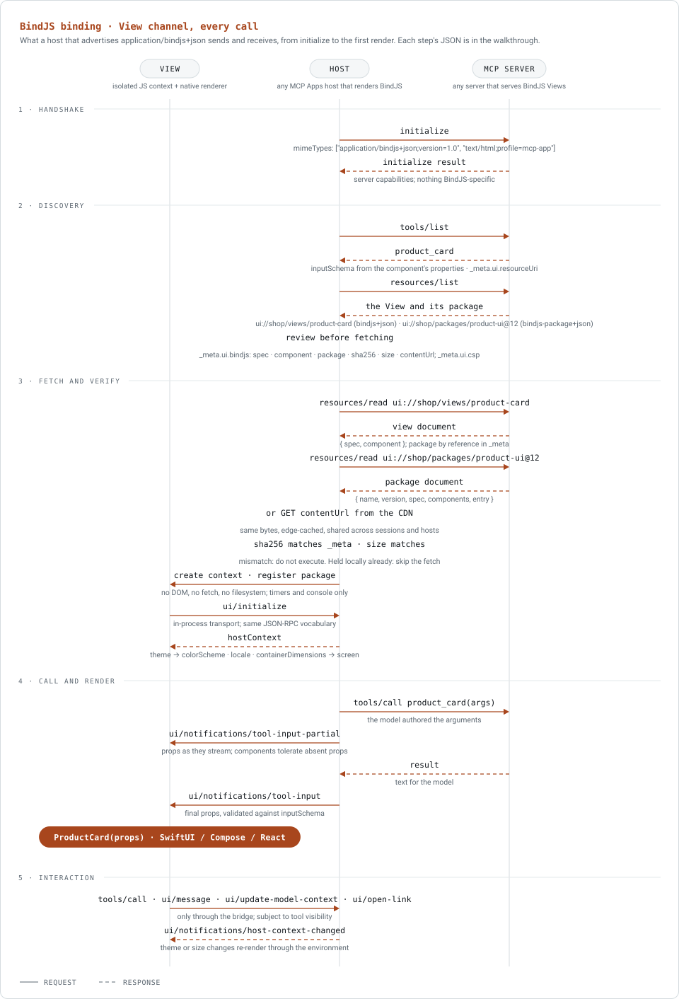
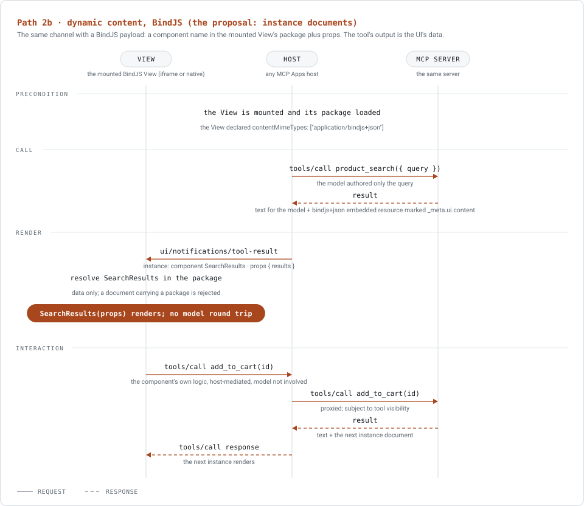

# BindJS on MCP Apps: a walkthrough of every call

Informative companion to the [MCP Apps binding](mcp-apps.md). It follows one tool, `product_card`, from `initialize` to the first render on a host that advertises `application/bindjs+json`, then shows the content channel with a second tool, `product_search`. Every message below is the wire shape a host implementer or a reviewer would check. Normative statements live in the binding; this document only illustrates them.



## 1. Handshake

The host says what it renders. Listing the HTML type as well keeps every other tool on the server working through the iframe path.

```jsonc
// initialize (host)
{ "method": "initialize", "params": { "capabilities": { "extensions": {
  "io.modelcontextprotocol/ui": { "mimeTypes": ["application/bindjs+json;version=1.0", "text/html;profile=mcp-app"] }
} } } }
```

The `version` parameter says the host renders BindJS 1.x up to 1.0; a host that implemented 1.2 would say `version=1.2` and still render every 1.0 and 1.1 View. Nothing in the server's `initialize` result is BindJS-specific.

## 2. Discovery

### 2.1 `tools/list`

The tool definition is derived from the entry component ([binding, section 2.5](mcp-apps.md#25-tool-definition-derived-from-the-component)): `inputSchema` from its `properties`, `title` and `description` from its `metadata`, annotations from `metadata.annotations` when declared. The `_meta.ui.resourceUri` is the ordinary SEP-1865 marker.

```jsonc
{ "name": "product_card",
  "title": "Product card",
  "description": "Show one product with price, availability, and a buy action. Use after the user names or picks a product.",
  "inputSchema": { "type": "object", "required": ["title", "price"],
    "properties": {
      "title":  { "type": "string", "description": "Product name as shown to the customer", "maxLength": 80 },
      "price":  { "type": "string", "description": "Formatted price, e.g. $120" },
      "height": { "type": "string", "enum": ["compact", "large"], "default": "compact" },
      "badges": { "type": "array", "description": "Zero or more badges to show under the title",
        "items": { "oneOf": [
          { "type": "object", "properties": { "_type": { "const": "ComponentInstance" }, "_component": { "const": "SaleBadge" }, "_id": { "type": "string" }, "percent": { "type": "integer" } }, "required": ["_type", "_component", "_id", "percent"] },
          { "type": "object", "properties": { "_type": { "const": "ComponentInstance" }, "_component": { "const": "NewBadge" },  "_id": { "type": "string" } }, "required": ["_type", "_component", "_id"] }
        ] } }
    } },
  "annotations": { "readOnlyHint": true, "idempotentHint": true },
  "_meta": { "ui": { "resourceUri": "ui://shop/views/product-card" } } }
```

The `badges` slot is a `PropertyComponent` array with `allowedComponents: ["SaleBadge", "NewBadge"]`; the discriminated union is the specification's component-instance encoding ([chapter 04](../spec/04-properties.md#component-instances-in-props-normative)).

### 2.2 `resources/list`

Two entries matter: the View, in the type the host declared, and the package it references. Both carry enough in `_meta` for the host to review and decide before fetching anything.

```jsonc
// the View
{ "uri": "ui://shop/views/product-card",
  "name": "product_card",
  "mimeType": "application/bindjs+json",
  "_meta": { "ui": {
    "csp": { "connectDomains": ["https://api.shop.example"], "resourceDomains": ["https://cdn.shop.example"] },
    "contentMimeTypes": ["application/bindjs+json"],          // this View also renders instance documents (section 5)
    "bindjs": { "spec": "1.0", "component": "ProductCard",
                "package": "ui://shop/packages/product-ui@12", "sha256": "9f2a…e1", "size": 48210 } } } }

// the package
{ "uri": "ui://shop/packages/product-ui@12",
  "name": "product-ui 12.0.0",
  "mimeType": "application/bindjs-package+json",
  "_meta": { "ui": { "bindjs": { "spec": "1.0", "name": "com.shop.product-ui", "version": "12.0.0",
                                 "sha256": "9f2a…e1", "size": 48210,
                                 "contentUrl": "https://cdn.shop.example/packages/product-ui@12.json" } } } }
```

What the host can decide here, before any fetch: whether the View's `spec` (its minimum required version) is within what the host declared, the network allowlist it will enforce (`csp`), whether it already holds `com.shop.product-ui` 12.0.0 with that digest (then it skips both reads below), and whether it accepts packages it did not bundle at all.

The same View is listed as `text/html;profile=mcp-app` to a host that advertised only HTML, and, by the developer's default policy, to a host whose declared `version` is below the View's `spec`. Nothing else changes.

## 3. Fetch and verify

```jsonc
// resources/read ui://shop/views/product-card  →
{ "contents": [{ "uri": "ui://shop/views/product-card", "mimeType": "application/bindjs+json",
  "text": "{\"spec\":\"1.0\",\"component\":\"ProductCard\"}" }] }
```

The view document names the entry component; the package comes by reference from `_meta.ui.bindjs.package`. (A server MAY inline the package in the view document instead; then there is one read, no digest, and no sharing between Views.)

```jsonc
// resources/read ui://shop/packages/product-ui@12  →
{ "contents": [{ "uri": "ui://shop/packages/product-ui@12", "mimeType": "application/bindjs-package+json",
  "text": "{
    \"name\": \"com.shop.product-ui\", \"version\": \"12.0.0\", \"spec\": \"1.0\",
    \"entry\": \"ProductCard\",
    \"components\": {
      \"ProductCard\": \"exports.default = defineComponent({ metadata: {…}, properties: {…}, body: (props) => VStack([…]) })\",
      \"PriceTag\":    \"exports.default = defineComponent({ … })\",
      \"SaleBadge\":   \"exports.default = defineComponent({ … })\",
      \"NewBadge\":    \"exports.default = defineComponent({ … })\",
      \"SearchResults\": \"exports.default = defineComponent({ … })\"
    },
    \"assets\": { \"ProductCard\": [ { \"name\": \"placeholder\", \"url\": \"https://cdn.shop.example/img/placeholder.jpg\" } ] }
  }" }] }
```

**Or from the CDN.** The package entry carried `contentUrl`. A host MAY fetch the same document from there instead of through the MCP connection: one edge-cached GET, shared across sessions and across every host that references `com.shop.product-ui` 12.0.0, with no server round trip. The bytes are the same document and go through the same checks; the digest in `_meta.ui.bindjs` is what makes the source irrelevant.

```jsonc
// GET https://cdn.shop.example/packages/product-ui@12.json  →  the identical package document
// then: sha256(body) == _meta.ui.bindjs.sha256, len(body) == size
```

This is also how the iframe path gets the package today: the HTML View fetches it from the CDN inside the sandbox, with the CDN origin allowlisted in `csp.resourceDomains`. On the native path the host does the fetch, before any code exists to constrain.

Host checks, in order: the SHA-256 of the `text` bytes (or the CDN body) equals `_meta.ui.bindjs.sha256` and the length equals `size` (mismatch: do not execute, log, fall back to the HTML listing if the host advertised it); `spec` major is supported; every component name is a valid identifier and unique after sanitization. Then the host creates the isolated context (no DOM, no filesystem, no storage, no network primitive; timers and `console` only), registers the package's sources, and opens the bridge:

```jsonc
// View → host, over the in-process transport
{ "jsonrpc": "2.0", "id": 1, "method": "ui/initialize", "params": { "appInfo": { "name": "product-card", "version": "12.0.0" } } }
// host → View
{ "jsonrpc": "2.0", "id": 1, "result": { "hostContext": { "theme": "dark", "locale": "en-US", "containerDimensions": { "width": 390 }, "displayMode": "inline" } } }
```

The runtime maps `theme` to the `colorScheme` environment key, `locale` to `locale`, and `containerDimensions` to `screen` ([binding, section 5.2](mcp-apps.md#52-host-context-mapping)).

## 4. Call and render

```jsonc
// tools/call (model, via host)
{ "method": "tools/call", "params": { "name": "product_card", "arguments": {
  "title": "Acme Runner", "price": "$120", "height": "large",
  "badges": [ { "_type": "ComponentInstance", "_component": "SaleBadge", "_id": "b1", "percent": 20 } ] } } }
```

While the model is still writing, the host forwards what it has:

```jsonc
// ui/notifications/tool-input-partial (host → View), an early prefix
{ "params": { "arguments": { "title": "Acme Runner", "price": "$120", "badges": [ { "_type": "ComponentInsta" } ] } } }
```

The runtime renders the prefix and renders nothing for the half-formed badge ([chapter 04, streaming tolerance](../spec/04-properties.md#component-instances-in-props-normative)). When the call completes:

```jsonc
// tools/call result (server → host): only the model's side of the transcript
{ "content": [ { "type": "text", "text": "Showing the Acme Runner product card." } ] }

// ui/notifications/tool-input (host → View): the final, validated props
{ "params": { "arguments": { "title": "Acme Runner", "price": "$120", "height": "large",
  "badges": [ { "_type": "ComponentInstance", "_component": "SaleBadge", "_id": "b1", "percent": 20 } ] } } }
```

The host has validated the arguments against `inputSchema` before delivering them. `ProductCard` receives them as props; `SaleBadge` is instantiated from the package for the `badges` slot; the runtime emits the view tree; the renderer draws SwiftUI, Jetpack Compose, or React.

Interaction goes only through the bridge, with the same vocabulary as the iframe path:

```jsonc
// View → host: a tap on "Buy" in the component's own logic
{ "jsonrpc": "2.0", "id": 7, "method": "tools/call", "params": { "name": "add_to_cart", "arguments": { "sku": "acme-runner-42" } } }
// View → host: tell the model what the user is looking at, without a turn
{ "jsonrpc": "2.0", "method": "ui/update-model-context", "params": { "content": { "selected": "acme-runner-42" } } }
// host → View: the theme changed
{ "jsonrpc": "2.0", "method": "ui/notifications/host-context-changed", "params": { "theme": "light" } }
```

## 5. The content channel: instance documents



The View above declared `contentMimeTypes: ["application/bindjs+json"]`, so a tool whose output is the UI's data can hand it to a component in the same package without the model re-emitting it.

```jsonc
// tools/list: the search tool points at the same View
{ "name": "product_search", "inputSchema": { "type": "object", "properties": { "query": { "type": "string" } } },
  "_meta": { "ui": { "resourceUri": "ui://shop/views/product-card" } } }

// tools/call product_search({ "query": "boots" })  →  result
{ "content": [
  { "type": "text", "text": "12 results for boots." },
  { "type": "resource",
    "resource": { "uri": "bindjs://shop/instances/search-1", "mimeType": "application/bindjs+json",
      "text": "{\"spec\":\"1.0\",\"component\":\"SearchResults\",\"props\":{\"results\":[{\"sku\":\"acme-runner-42\",\"title\":\"Acme Runner\",\"price\":\"$120\"}]}}" },
    "_meta": { "ui": { "content": {} } } }
] }
```

The host delivers the marked resource to the View in `ui/notifications/tool-result`, unmodified and not added to model context. The View resolves `SearchResults` in its package and renders it with the props. A document carrying a `package` field on this channel is rejected: code never arrives through a result.

## 6. What the host never does

It never executes anything it did not read from a `ui://` resource it listed (or hold locally with a matching digest). It never exposes `fetch`, a DOM, or a filesystem to the context. It never lets a View reach a tool the iframe path could not reach. It never loads an asset from a domain outside `csp.resourceDomains` or a tool endpoint outside `csp.connectDomains`. Everything a View can do is in the bridge table in [binding, section 5](mcp-apps.md#5-bridge-binding).
